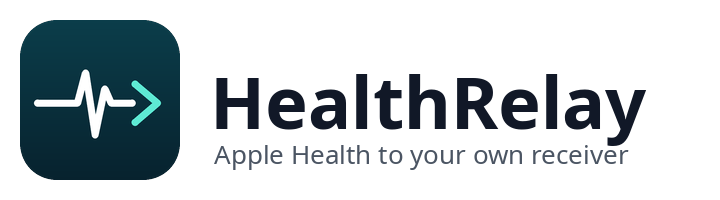
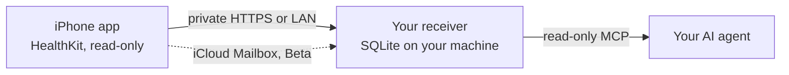

<div align="center">
  <picture>
    <source media="(prefers-color-scheme: dark)" srcset="assets/brand/healthrelay-lockup-dark.png">
    
  </picture>

  <h3>Your Apple Health data, continuously available to your own AI agent.</h3>

  <p>Self-hosted receiver · read-only AI access · no hosted relay, no third-party model</p>

  <p>
    
    
    
    
  </p>

  <p>
    <a href="#1-build-and-install-the-iphone-app"><strong>Build the iPhone app</strong></a> ·
    <a href="docs/setup.md"><strong>Set up your bridge</strong></a> ·
    <a href="docs/supported-health-data.md"><strong>Supported health data</strong></a> ·
    <a href="#privacy-and-security"><strong>Privacy</strong></a>
  </p>
</div>

> [!NOTE]
> **HealthRelay is a fork of Apple Health AI Bridge** (Apache-2.0). See [`FORK.md`](FORK.md) and [`NOTICE`](NOTICE). This README is adapted from upstream's; the upstream product (Health Bridge for AI, on the App Store) is a separate app and is not needed for HealthRelay.

## What HealthRelay adds

HealthRelay builds on Apple Health AI Bridge, the open-source project behind Health Bridge for AI. It keeps the upstream design (HealthKit read-only, your own receiver, read-only MCP) and adds the pieces below. Each one changes the batch contract, the receiver schema and the iPhone app together, which is why they live in a fork rather than in a configuration of the upstream app. The full, dated list is in [`FORK.md`](FORK.md).

| Capability | Upstream app | HealthRelay |
| --- | --- | --- |
| **Electrocardiograms** | Not read | Apple Watch ECG recordings with voltage traces, synced through a dedicated foreground lane (new `electrocardiograms` batch field, receiver migration 010) |
| **Dietary nutrients** | Partial set | All 38 HealthKit dietary quantity types, with g / mg / mcg / kcal units |
| **Medication dose events** | Not read | Logged doses from the Health app's Medications feature (iOS 26 and later), with per-object read authorization (new `medication_dose_events` field, migration 011) |
| **Lab results from an Apple Health export** | Not supported | "Import Health Export" reads `export.zip` on the phone, parses only the FHIR clinical records, shows a count for review, and sends only after you confirm. Nothing is unpacked to disk and the zip never leaves the device (new `lab_results` field, migration 012) |
| **First-sync history window** | Fixed presets | Adds a 7-day option, and the ECG and medication lanes honor the chosen window |
| **Activity Log** | Generic status labels | Names the lane on each row and collapses runs of empty results into one counted line, so a manual sync reads as a short sequence instead of dozens of identical rows |
| **Own identity and pairing** | Shares the upstream app's scheme | `healthrelay://pair` scheme, own name, icon and bundle id, so a scanned pairing code cannot open the upstream app |
| **Release path** | App Store build | Unsigned IPA built by CI and published as a GitHub Release with a SHA-256, for you to sign with your own certificate |

Fixes found by running the fork against a real receiver and phone (all in [`FORK.md`](FORK.md)):

- The Cancel button now stops the always-on Automatic Sync engine and appears during automatic-only runs.
- The receiver no longer permanently rejects Apple Health export uploads with HTTP 403; because the outbox is strictly first-in-first-out, that one rejected item used to block every lane queued behind it.
- ECG is kept out of the automatic background lane set, where its foreground-only type stalled the whole sync cycle.

The generic pieces (ECG, dietary types, workouts) are intended to be offered upstream as pull requests. The medication, lab-import and receiver-specific parts stay here. HealthRelay is built and installed by you; there is no App Store listing.

## How it works



The project gives you a direct, self-hosted path from Apple Health to the AI tools you choose, without routing it through a hosted intermediary. The iPhone companion continuously sends the HealthKit data you permit to a receiver you control, where read-only CLI and MCP interfaces make it available to compatible agents.

Your health data stays under your control: the receiver and database run on your infrastructure, AI access is read-only, and no hosted relay or third-party model is required.

Automatic background sync is designed for continuous use. iOS controls background scheduling, so delivery timing is best-effort rather than real-time or guaranteed at a specific moment.

## Set up the bridge

**You need:**

- an iPhone running iOS 18 or later;
- a macOS or Linux computer that will run the receiver and store the private database; native Windows is not currently supported;
- for continuous sync, a stable private HTTPS route that the physical iPhone can reach away from the local network; for an explicit local-only evaluation, a same-LAN route with the limitation below;
- an MCP client on the receiver machine, or a terminal for direct CLI access;
- [`uv`](https://docs.astral.sh/uv/) for the receiver package.

### 1. Build and install the iPhone app

HealthRelay is not on the App Store. Build it yourself, then sign and install it with your own Apple developer identity (a sideload signer or Xcode):

- **GitHub Releases:** download the latest stable unsigned IPA from the [Releases page](https://github.com/mwdearing/health-relay/releases/latest) — no Actions run needed. New builds are published first as **beta pre-releases** and only become the stable release after they have been verified on a device, so the page's "Latest" release is the one to use.
- **GitHub Actions:** run the `Build unsigned IPA` workflow (Actions → Build unsigned IPA → Run workflow) with your bundle identifier and marketing version, download the `HealthRelay-unsigned-ipa-*` artifact, and sign it on your phone or Mac.
- **Xcode 16 or later:** follow [docs/self-build.md](docs/self-build.md).

Either way, the IPA you get is **unsigned**. You must sign it with your own Apple developer certificate before it will install — the same way you'd sideload any other unsigned iOS app (a sideload signer such as AltStore or Sideloadly, or Xcode with your own team). HealthRelay has no App Store listing and the maintainer does not distribute a pre-signed build.

#### Sign with an App ID that has HealthKit

Sign with a **provisioning profile for an explicit App ID that has the HealthKit capability**, and keep that profile's HealthKit entitlement in the signed app. A wildcard App ID, or a signer that drops the entitlement, still installs the app, but Apple Health will not list it and its permissions cannot work.

- **Set the bundle identifier to that App ID *before* the IPA is built.** Run the `Build unsigned IPA` workflow with your final App ID as the bundle identifier. The app reads its background-refresh task identifier from `BGTaskSchedulerPermittedIdentifiers`, which is written into the IPA at build time, and falls back to `<bundle id>.refresh` only when that list is absent, so the refresh task still registers after a re-sign. Other identifiers are derived from the bundle identifier at run time, including the Keychain service that holds the receiver pairing and the background upload session, so an IPA that is only re-signed under a different bundle identifier does not find a pairing saved under the earlier one.
- **Check the Health listing:** after installing, look under Health › Profile › Privacy › Apps. HealthRelay should already be listed; if it is not, open the app, allow Health access when asked, and look again. If it is still missing, the signature lacks the HealthKit entitlement: fix the profile and re-sign.
- **Changing the bundle identifier later means pairing again,** because the receiver sees the new install as a new source.

> [!TIP]
> If you previously used the upstream Health Bridge for AI app, remove it before pairing HealthRelay so a scanned pairing QR code opens the right app.

### 2. Prepare the receiver route

The project does not give you a receiver URL. The URL is the private address by which the iPhone reaches your receiver computer, and it must exist before core setup can create pairing material.

| Route | Best for | Notes |
| --- | --- | --- |
| **A. Tailscale Serve** | You already use Tailscale | Private HTTPS, documented in the [setup guide](docs/setup.md#route-a-already-use-tailscale). An option for existing users, not a requirement. |
| **B. Agent-assisted private HTTPS ingress** | Everyone else wanting sync away from home | The setup agent inspects first, shows every proposed DNS, tunnel, proxy, firewall, and service change, and waits for approval before applying it. |
| **C. Local network only** | A deliberate local-only evaluation | Automatic sync stops when the iPhone leaves that network. |

> [!WARNING]
> Do not copy a sample hostname, expose receiver port `8765` directly to the public internet, or publish the pairing page. Follow the complete [receiver setup guide](docs/setup.md) to produce and verify the real route.

### 3. Install and run setup

Install the receiver from this repository's `main` branch (the package keeps its upstream name, `apple-health-ai-bridge`; the command is `health-bridge`):

```bash
uv tool install "git+https://github.com/mwdearing/health-relay.git"
```

To update it later, run `uv tool upgrade apple-health-ai-bridge`. Do not install upstream `roian6/apple-health-ai-bridge`: it lacks this repository's receiver changes.

To freeze one known receiver state instead of tracking `main`, install a pinned receiver release: `uv tool install "git+https://github.com/mwdearing/health-relay.git@healthrelay-receiver-2026.10.04"`. Its tag names an immutable commit and the package version is unchanged; see [versioning](docs/versioning.md#pinned-receiver-releases).

The route-specific guide sets `HEALTH_BRIDGE_RECEIVER_URL` to the exact configured `/v1/batches` URL. Only then run:

```bash
health-bridge setup --receiver-url "$HEALTH_BRIDGE_RECEIVER_URL"
```

<details>
<summary><strong>Route C: local-network-only setup command</strong></summary>

Use the same real LAN URL and the required non-loopback bind:

```bash
health-bridge setup \
  --receiver-url "$HEALTH_BRIDGE_RECEIVER_URL" \
  --receiver-host 0.0.0.0 \
  --receiver-port 8765
```

</details>

`health-bridge setup` creates the private SQLite database and single-use pairing page, prepares the receiver command, emits a canonical same-host stdio MCP descriptor, verifies the local MCP process, and detects client adapters without modifying them.

A successful local MCP check does not prove receiver readiness or phone reachability. Put the printed receiver command under the host's approved service manager, start it, require `{"status":"ok"}` from the printed local `/health` URL, and then require the same response from the exact phone-facing `/health` URL on the physical iPhone. Routes A and B use HTTPS; Route C uses HTTP only on the same trusted LAN.

Adding a client creates another process that can read the private health database, so setup never does that automatically. Use an explicit `--configure-client <name>` only after choosing the client.

<details>
<summary><strong>Delivery transports: Direct and Encrypted iCloud Mailbox (Beta)</strong></summary>

Direct is the default transport, including direct private HTTPS and trusted-LAN setups. Encrypted iCloud Mailbox is an explicit opt-in, Mac-only Beta; a Direct failure never switches transports automatically.

The Beta applies application-layer encryption and signatures before an envelope reaches the user's iCloud container. The user's Mac receiver decrypts and commits accepted batches, then returns an encrypted, signed ACK; the app advances committed local progress only after validating a committed ACK. The iCloud container and receiver remain user-owned. Mailbox ACK publication also requires the exact signed, notarized macOS helper published with Receiver/CLI `1.1.1`; users verify and explicitly install it before the optional per-user LaunchAgent. Follow the [mailbox service guide](docs/icloud-mailbox-service.md).

</details>

### 4. Pair and sync

1. Continue only after the supervised receiver, local health check, and physical-iPhone health check all pass.
2. On the receiver computer, open the generated pairing page on a trusted screen. For a headless receiver, securely copy that one file to a trusted local screen; never publish it or place it on a web server.
3. Scan the QR code with iPhone Camera, open the setup link, and connect the app.
4. Tap **Allow Health Access** and review Apple's native authorization sheet.
5. Turn on **Automatic Sync**.
6. Wait for the first successful receiver upload, then ask your agent about your data.

**Try asking:**

- "Show yesterday's workouts and wake-date sleep."
- "Which Apple Health metrics have synced recently?"
- "Summarize my last seven days of activity and mark any source or sync gaps."

## Use it with Hermes Agent

If your agent is [Hermes Agent](https://github.com/NousResearch/hermes-agent), companion plugins connect it to this receiver. They are separate repositories, read-only or local-only, and none is required to use HealthRelay. The [Full setup guide](docs/full-setup.md) walks through the whole chain in order, with a check after each step.

| Plugin | What it gives your agent |
| --- | --- |
| [**hermes-healthrelay**](https://github.com/mwdearing/hermes-healthrelay) | Read-only MCP access to your receiver database (ten tools: sync status, synced metrics, time series, daily, sleep and workout summaries, sources, and intake evidence) plus skills for setup, review and troubleshooting |
| [**hermes-health-insights**](https://github.com/mwdearing/hermes-health-insights) | A local analysis tool and skills: weekly trends, rule-based concern checks, nutrition against Dietary Reference Intakes, an energy target and lab results |
| [**hermes-medlog**](https://github.com/mwdearing/hermes-medlog) | A deterministic medication log with skills: record doses, list what is missing, import dose events from this receiver (never infers a dose or gives advice) |

```bash
hermes plugins install mwdearing/hermes-healthrelay --no-enable
hermes plugins enable healthrelay
```

Set up the receiver and the iPhone app above first, then follow the plugin's `healthrelay-setup` skill to point it at your receiver database. Health data is sensitive: use a local model, or one you trust with it. `hermes-healthrelay` and `hermes-health-insights` are listed in the Hermes plugin catalog. The catalog pins hermes-healthrelay 0.4.3 (ten tools, including intake evidence); installing by repository name as shown gets the current version.

## What the agent can see

The companion requests every HealthKit type that is both implemented by the app and available on the current iOS runtime. Unsupported or unavailable types remain absent rather than being fabricated. See the versioned [supported health data reference](docs/supported-health-data.md).

The MCP server is read-only and exposes bounded, source-grounded tools:

| Tool area | What it returns |
| --- | --- |
| Status | Bridge and sync status |
| Catalogs | Supported and currently synced metrics |
| Time series | Observations for a metric over a range |
| Workouts | Workout sessions |
| Sleep | Sleep summaries |
| Daily | Daily summaries |
| Provenance | Which source recorded each value |

It does not expose raw SQL, token material, cursor values, or clinical recommendations.

## Privacy and security

- HealthKit access is read-only.
- The receiver and SQLite database are user-owned.
- The project has no hosted health-data backend.
- Pairing invitations are temporary and single-use.
- Device credentials are stored in the iOS Keychain and hashed at rest by the receiver.
- Logs and agent status omit health values and credentials by default.
- The receiver is designed for one trusted user, not mutually untrusted tenants.
- The developer does not operate or have access to the user's receiver or iCloud container. A "Data Not Collected" App Privacy answer remains valid only while that developer-no-access boundary remains true.

> [!IMPORTANT]
> Do not expose the receiver's loopback port or pairing page to the public internet. For continuous sync away from home, use an existing private-network HTTPS route such as Tailscale Serve or an agent-assisted private HTTPS ingress reviewed for the receiver paths. LAN-only access is a limited fallback.

Report vulnerabilities through GitHub's private vulnerability reporting flow described in [SECURITY.md](SECURITY.md).

<details>
<summary><strong>Remove local bridge data</strong></summary>

Stop the receiver, then inspect the exact deletion scope with the default dry-run:

```bash
health-bridge receiver purge --db ~/.local/share/health-bridge/health.sqlite
```

Run the same command with `--confirm` only after reviewing the listed database and SQLite sidecars. Confirmation is refused while the receiver is still using the database. This removes the local bridge copy and does not delete Apple Health data. Empty private `.lifecycle.lock` and `.access.lock` coordination files and a private `.purge-*` directory containing zero-byte tomb files may remain; they contain no health records.

If the command returns `recovery-required`, do not restart the receiver. Review the structured source, quarantine, and truncated path lists; the command deliberately keeps the private quarantine instead of claiming a rollback after an irreversible partial purge.

</details>

## Component versions

The repository contains independently released components. Always include the component label rather than referring to an unlabeled "repo version."

| Surface | Current version | Identifier |
| --- | --- | --- |
| Receiver/CLI | `1.1.1` | `version` in `pyproject.toml`, installed from `main` |
| iOS Companion (HealthRelay) | `1.2.0` | release tag `app-v<marketing-version>` (default `1.2.<run>`); build number = `Build unsigned IPA` workflow run number |
| Batch Protocol | `1.0.0` | `health_bridge.batch.v1` |

These numbers do not need to match. Receiver-only fixes must not force an unchanged iOS Companion update, and compatible product patches must not bump the Batch Protocol. The versions in the table above are authoritative for HealthRelay; [`component-versions.json`](component-versions.json) is upstream bookkeeping. See the complete [versioning and compatibility policy](docs/versioning.md).

<details>
<summary><strong>How releases are published</strong></summary>

The app ships as an unsigned IPA on GitHub Releases (`app-v<marketing-version>` tags, default marketing version `1.2.<run>`, from the `Build unsigned IPA` and `Publish IPA release` workflows). New builds are pre-releases (betas); the stable release is marked Latest after an approval-gated promotion. The receiver is installed from `main` of this repository, so a fix lands for users once it is merged. A pinned receiver release (`healthrelay-receiver-<YYYY.MM.DD>`) is the alternative when you want one known commit: it is not marked Latest, and the package version stays unchanged. There are no `receiver-v*` or `ios-v*` tags in this fork. See [versioning](docs/versioning.md).

</details>

## Documentation

| Use HealthRelay | Reference | Contribute |
| --- | --- | --- |
| [Setup](docs/setup.md), [Full setup with Hermes](docs/full-setup.md) | [Architecture and trust boundaries](docs/architecture.md) | [Contribution ideas](docs/contribution-ideas.md) |
| [Build the iOS app](docs/self-build.md) | [Batch contract](docs/reference/batch-v1.md) | [Maintainer workflow](docs/maintainer-guide.md) |
| [Supported health data](docs/supported-health-data.md) | [SQLite schema](docs/reference/sqlite-v1.md) | [Contributing](CONTRIBUTING.md) |
| [Support routes](SUPPORT.md) | [Brand guide](docs/brand.md) | [Security policy](SECURITY.md) |

## Development

Your own build is the only installation path for HealthRelay: the `Build unsigned IPA` workflow (see [step 1](#1-build-and-install-the-iphone-app)) or Xcode 16 or later following [docs/self-build.md](docs/self-build.md). For the receiver:

```bash
uv sync --all-extras --dev --locked
uv run pytest -q
uv run ruff check .
uv run basedpyright
```

Synthetic fixtures and smoke commands are contributor tools, not part of user onboarding. See [CONTRIBUTING.md](CONTRIBUTING.md).

---

<sub>Upstream project (attribution, not HealthRelay support): [Website](https://healthbridge.chanhyo.dev/) · [Privacy](https://healthbridge.chanhyo.dev/privacy) · [Support](https://healthbridge.chanhyo.dev/support). Those pages describe the upstream Health Bridge for AI product; HealthRelay issues go to this repository.</sub>

<sub>Apple Health AI Bridge is an independent open-source project and is not affiliated with, endorsed by, or sponsored by Apple Inc. Licensed under Apache-2.0; see [LICENSE](LICENSE).</sub>
